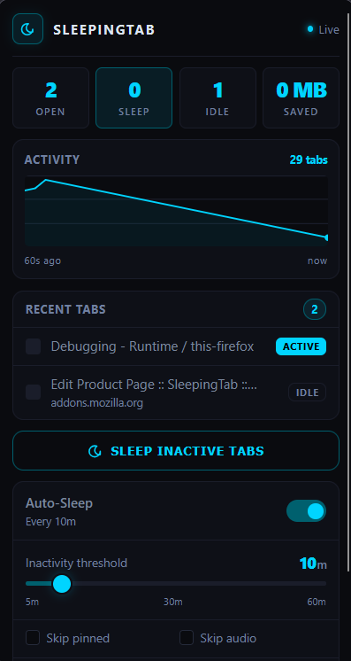
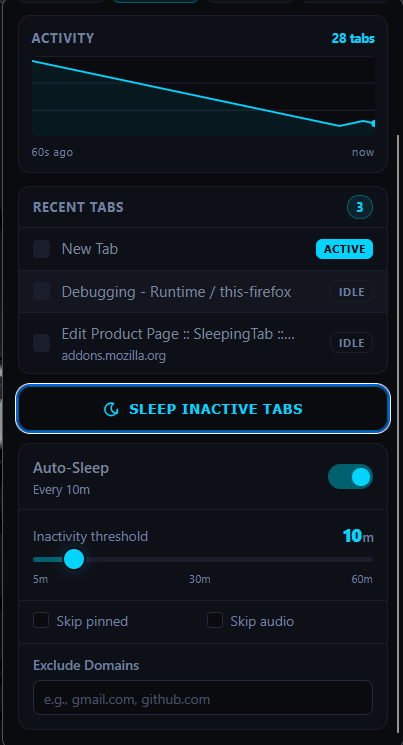

<p align="center">
  
</p>

<h1 align="center">SleepingTab 🌙</h1>

<p align="center">
  A professional, high-performance, and privacy-first tab manager for Firefox. SleepingTab keeps your browser running at peak efficiency by automatically sleeping (discarding) idle tabs, saving significant system memory, and extending laptop battery life.
</p>

<p align="center">
  
  
</p>

---

##  Key Features

* **Instant Graph Rendering** — Displays tab count history instantly when opened. It leverages `storage.session` to render state timelines with **0ms latency** (no "Gathering data..." delay).
* **RAM Savings Tracker** — Automatically computes and displays estimated system memory saved (e.g. `1.2 GB Saved`) by monitoring discarded tabs.
* **Smart Auto-Sleep** — Configurable timer to sleep inactive tabs. Uses **dynamic background alarm frequencies** (checking every 5 to 15 minutes depending on your threshold) to reduce CPU wakeups by up to 93%.
* **Exclusion Rules & Whitelisting** — Prevents sleeping of pinned tabs, tabs playing media/audio, and custom domain exclusions (e.g., `gmail.com`, `slack.com`).
* **One-Click Manual Sleep** — Discard all background tabs instantly with a single click, respecting all whitelist and ignore settings.
* **Cyberpunk Dark Aesthetics** — Features a premium, Raycast/Linear-inspired dark interface with glowing indicator accents and tabular-numeric formatting.
* **Keyboard Accessible** — Focus outlines and Esc key mappings provide seamless keyboard controls for all sliders, switches, and tabs.

---

##  Privacy & Compliance

SleepingTab is designed to be completely native, lightweight, and trustworthy:
* **Zero Telemetry / Zero Tracking** — No data collection, tracking scripts, or analytics.
* **Zero Remote Code** — 100% self-contained code running locally. Satisfies strict Mozilla Add-on Store policies.
* **Least Privilege Permissions** — Declares only `tabs`, `storage`, and `alarms` (no `downloads` or hosts permissions).
* **Gecko Compliant** — Includes the required `data_collection_permissions` manifest metadata.

---

##  Architecture

```
                                  [ browser.tabs Events ]
                                             │
┌─────────────────────────┐                  ▼                  ┌─────────────────────────┐
│     popup.html/.js      │ ◄────────── [ Read ] ─────────────► │   background.js (MV3)   │
│  (Disposable Event UI)  │                                     │    (Event-driven page)  │
└────────────┬────────────┘                                     └────────────┬────────────┘
             │                                                               │
          [ Read ]                                                        [ Sync ]
             │                                                               │
             ▼                                                               ▼
 ┌───────────────────────────────────────────────────────────────────────────────────────┐
 │                                   browser.storage                                     │
 │  ┌───────────────────────────────┐                  ┌───────────────────────────────┐ │
 │  │        storage.session        │                  │         storage.sync          │ │
 │  │  • currentTabCount (Number)   │                  │  • autoSleep (Boolean)        │ │
 │  │  • peakTabCount (Number)      │                  │  • sleepMinutes (Number)      │ │
 │  │  • history (Array of counts)  │                  │  • whitelist (Array)          │ │
 │  └───────────────────────────────┘                  └───────────────────────────────┘ │
 └───────────────────────────────────────────────────────────────────────────────────────┘
```

The extension is engineered as a **synchronized, event-driven cache**:
1. **Zero Active Polling:** The background event page is non-persistent under Manifest V3 and unloads when idle. 
2. **State Sync via Storage:** Settings are stored in `storage.sync`. Updates are monitored reactively using `browser.storage.onChanged` in the background script.
3. **Cache-Backed UI:** The tab count history array is maintained dynamically in `storage.session` on tab create/remove events. The popup reads from this cache instantly without performing slow, synchronous `browser.tabs.query` operations on open.

---

##  Developer Setup & Installation

### Running Locally (Temporary Add-on)
1. Open Firefox and go to `about:debugging#/runtime/this-firefox`.
2. Click **"Load Temporary Add-on..."**.
3. Select `manifest.json` from this project folder.
4. The SleepingTab icon will appear in your browser toolbar.

### Local Quality Assurance
Verify source code compliance using the official Mozilla Extension Linter:
```bash
# Run the official linter
npx web-ext lint --source-dir .
```

---

##  Release & Deployment

The project is configured for automated packaging and signing via Mozilla's `web-ext` CLI.

### Pre-release Steps
1. **Toggle Production Logging:** In [background.js](file:///d:/Vibe_Coding/Firefox_Extensions/SleepingTab/background.js), make sure `const DEBUG` is set to `false`. This prevents verbose debug statements from cluttering the user's browser console in production.
2. **Setup Credentials (for Add-ons Store):** Copy `.env` to configure your developer keys (ignored by Git):
   ```bash
   cp .env.example .env # Or edit the existing .env file
   ```
   Retrieve your JWT credentials from the [Mozilla Developer Center](https://addons.mozilla.org/en-US/developers/addon/api/key/).

### Packaging & Signing
3. Run the packaging command to compile a production `.zip`/`.xpi` file. Ensure that development/secret files (like `.env`, `.gitignore`, documentation, and screenshots) are excluded from the bundle:
   ```bash
   npx web-ext build --source-dir . --overwrite-dest --ignore-files .env .gitignore README.md "screenshot*.png"
   ```
4. Sign the package for self-distribution (optional):
   ```bash
   npx web-ext sign --api-key=$WEB_EXT_API_KEY --api-secret=$WEB_EXT_API_SECRET --ignore-files .env .gitignore README.md "screenshot*.png"
   ```

---

## 📄 License

This project is licensed under the MIT License — see the [LICENSE](LICENSE) file for details.