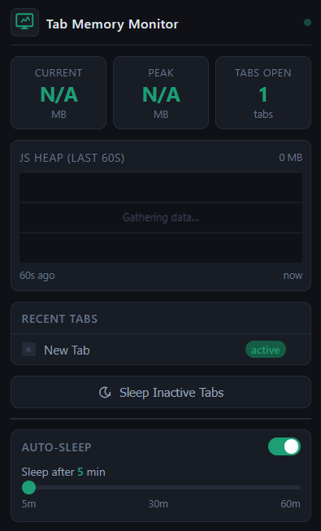

# Tab Memory Monitor

A Firefox extension that monitors JavaScript heap memory usage and automatically manages tab sleep to free up memory.

## Features

- **Real-time memory graph** — Visualizes JS heap usage over the last 60 seconds
- **Tab statistics** — Shows current memory, peak usage, and open tab count
- **Recent tabs list** — Displays your most recently accessed tabs with status badges
- **Sleep inactive tabs** — Manually discard inactive tabs to free memory
- **Auto-sleep** — Configurable automatic tab discarding after a set idle time (default: 15 minutes)

## Installation (Temporary)

1. Open Firefox and navigate to `about:debugging#/runtime/this-firefox`
2. Click **"Load Temporary Add-on..."**
3. Navigate to the extension folder and select `manifest.json`
4. The extension icon will appear in your toolbar

The extension will remain loaded until you restart Firefox.

## Permissions

| Permission | Why |
|------------|-----|
| `tabs` | Required to query tab state, access titles/favicons, and discard tabs |
| `storage` | Stores your auto-sleep preferences (toggle and timer duration) |
| `alarms` | Enables the periodic auto-sleep check (runs every 1 minute when enabled) |

**No host permissions** — This extension does not access any websites. It only reads metadata (title, favicon, discard state) of open tabs.

## Privacy

- No data is collected or transmitted
- No telemetry
- All preferences are stored locally via Firefox's `storage.sync` API
- Manifest declares `data_collection_permissions: { "required": ["none"], "optional": [] }`

## License

Free and open source by [roxu](https://github.com/roxu).

---

Built with the WebExtensions API for Firefox (Manifest V3).