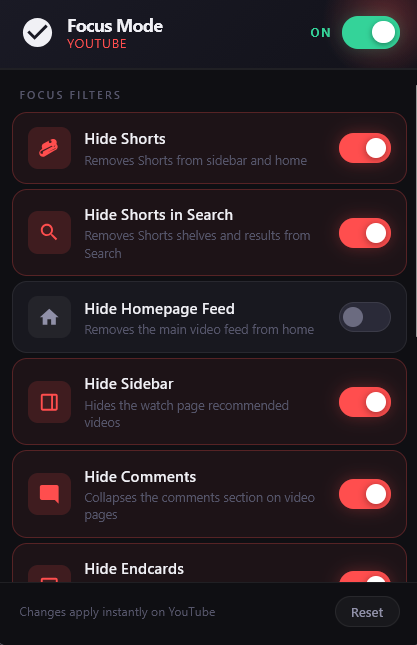
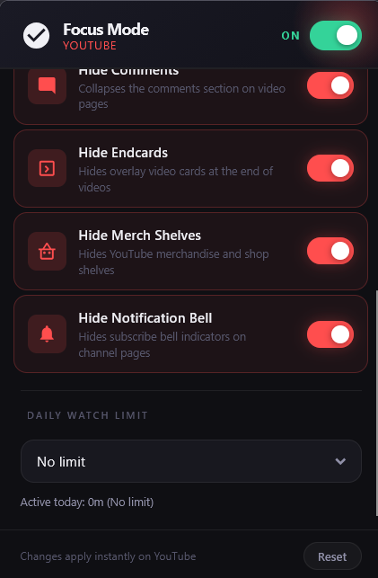

<p align="center">
  
</p>

<h1 align="center">YouTube Focus Mode 🎯</h1>

<p align="center">
  A professional, high-performance, and privacy-first distraction blocker for YouTube on Firefox. YouTube Focus Mode helps you take back control of your time by selectively hiding Shorts, the homepage feed, recommended videos, and comment sections with absolute zero latency.
</p>

<p align="center">
  
  
</p>

---

##  Key Features

* **Hide Shorts** — Completely scrubs YouTube Shorts shelves from the homepage grid, sidebar navigation menu, related video recommendations, and search result feeds.
* **Hide Homepage Feed** — Removes the main distraction-heavy video feed from the YouTube home page, replacing it with a clean interface to encourage search-focused intent rather than mindless scrolling.
* **Hide Recommendations** — Hides the right-side related video suggestion panel on watch pages and automatically expands the main video player to fill the layout for an immersive, distraction-free viewing experience.
* **Hide Comments** — Hides the comment section on video watch pages, preventing distraction and keeping your focus purely on learning or content ingestion.
* **Daily Watch Limit Tracker** — Set a daily time allowance (e.g., 30 minutes). A background script actively tracks your YouTube watch time and displays a customizable cyberpunk-style blocker overlay with a snooze function when your focus limit is reached.
* **One-Click Master Toggle** — Instantly enable or disable all focus filters globally with a single tactile switch in the header.
* **Premium Glassmorphism UI** — Built with clean Inter typography, handcrafted modern SVG iconography, micro-interactive hover transitions, and a smart dynamic reset button with instant feedback.
* **Auto-Syncing Settings** — All changes and filters apply instantly to all active YouTube tabs in real-time, saved securely to `browser.storage.sync` with zero manual page refreshes required.

---

##  Privacy & Compliance

YouTube Focus Mode is built to be secure, lightweight, and completely transparent:
* **Zero Telemetry / Zero Tracking** — No background tracking scripts, no third-party APIs, and no telemetry data collection. Your browsing habits remain entirely yours.
* **Zero Remote Code** — 100% locally contained code execution to guarantee absolute security and comply with the strictest Mozilla Add-on Store policies.
* **Least Privilege Permissions** — Declares only the minimal `storage` permission for saving toggle states. No intrusive access to downloads, bookmarks, or browser history.
* **Gecko Compliant** — Designed for modern Firefox (128.0+ / MV3) with strict declarations and clean standard host permissions (`*://*.youtube.com/*`).

---

##  Architecture

```
                                [ YouTube DOM Events & SPA Renders ]
                                                 │
 ┌─────────────────────────┐                     ▼                     ┌─────────────────────────┐
 │     popup.html/.js      │ ◄─────────── [ Read / Write ] ──────────► │     content.js (MV3)    │
 │ (Inter/Glassmorphism UI)│                                           │ (DOM Mutation Observer) │
 └───────────┬─────────────┘                                           └───────────┬─────────────┘
             │                                                                     │
 ┌───────────▼─────────────┐                                                    [ Read ]
 │    background.js (MV3)  │                                                       │
 │  (Alarms API Tracker)   │                                                       ▼
 └───────────┬─────────────┘                 ┌───────────────────────────────────────────────────┐
             │                               │               browser.storage.local               │
          [ Write ]                          │  • secondsWatchedToday     • snoozedToday         │
             │                               └───────────────────────────────────────────────────┘
             ▼                                                                     ▼
 ┌─────────────────────────────────────────────────────────────────────────────────────────────┐
 │                                    browser.storage.sync                                     │
 │  ┌───────────────────────────────────────────────────────────────────────────────────────┐  │
 │  │ • masterEnabled: true/false       • hideHomepageFeed: true/false                      │  │
 │  │ • hideShorts: true/false          • watchLimitMinutes: 0-90                           │  │
 │  │ • hideComments: true/false                                                            │  │
 │  └───────────────────────────────────────────────────────────────────────────────────────┘  │
 └─────────────────────────────────────────────────────────────────────────────────────────────┘
```

The extension is engineered with high-efficiency frontend paradigms:
1. **Zero-Latency Injected Stylesheet**: Inserts a single `<style>` element with ID `__yfm_styles__` at `document_start`. It applies highly optimized standard CSS selectors to hide elements natively, preventing layout thrashing or pop-in flickers.
2. **SPA-Resilient Mutation Observer**: YouTube uses a modern single-page application framework that constantly destroys and rebuilds the DOM. The injected content script employs a high-performance `MutationObserver` to watch `document.documentElement` reactively, ensuring that our stylesheet is continuously maintained and active without consuming high CPU cycles.
3. **Reactive Settings Synchronizer**: Listens to changes in `browser.storage.onChanged` in the storage area sync, so when you click a filter toggle in the action popup, the changes are dynamically propagated and applied to all running YouTube instances instantly.
4. **Background Alarm Tracker**: Employs the `browser.alarms` API in `background.js` to poll active YouTube tabs every 1 minute. This ensures highly efficient tracking of watch time that naturally pauses when YouTube is not the focused window, resetting automatically at midnight.

---


##  Developer Setup & Installation

### Running Locally (Temporary Add-on)
1. Open Firefox and navigate to `about:debugging#/runtime/this-firefox`.
2. Click the **"Load Temporary Add-on..."** button.
3. Select `manifest.json` from this repository's folder.
4. The YouTube Focus Mode icon will appear in your browser toolbar/addons list. Click it to open the popup.

### Local Quality Assurance
Verify source code compliance using the official Mozilla Extension Linter:
```bash
# Run the official linter
npx web-ext lint --source-dir .
```

---

##  Release & Packaging

The project is configured for rapid packaging and validation via Mozilla's official `web-ext` command-line utility.

### Packaging
Run the packaging command to compile a production-ready `.zip`/`.xpi` file. This command automatically filters out development metadata, secrets, and raw assets that shouldn't be included in the production bundle:
```bash
npx web-ext build --source-dir . --overwrite-dest --ignore-files .gitignore README.md "screenshot*.png"
```

### Self-Distribution Signing
To generate a signed `.xpi` package for self-distribution:
```bash
npx web-ext sign --api-key=$WEB_EXT_API_KEY --api-secret=$WEB_EXT_API_SECRET --ignore-files .gitignore README.md "screenshot*.png"
```
Retrieve your JWT credentials from the [Mozilla Developer Center](https://addons.mozilla.org/en-US/developers/addon/api/key/).

---

##  License

This project is licensed under the MIT License — see the [LICENSE](LICENSE) file for details.